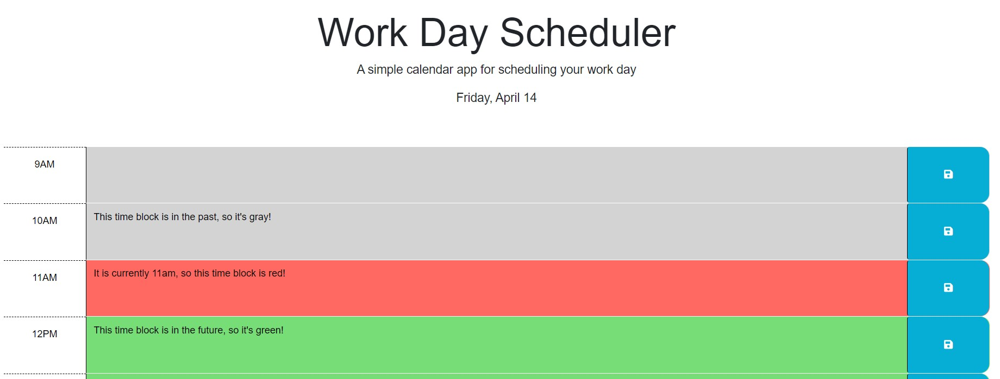

# Schedule Planner

## Description

This simple planner can be used to schedule a standard work day. It features different colors to visually represent time in the past, present, and future. This project was made in order to practice using third party APIs and other basic coding principles.

## Installation

This application requires no installation. Find it here: https://blee241.github.io/Schedule-Planner/.

## Usage

The scheduler features a total of nine time blocks. Each one represents one hour in a standard nine-to-five work day schedule.

The color of the time blocks will change depending on the local time of your computer. Gray indicates that the hour has already passed. Red indicates the current hour. Green indicates that the time block is in the future.

Each time block can be clicked on. To save an event on the planner, click on a time block and type to enter text into it. There is a blue save button to the right of each time block. Click on the save button to save the text into the local storage. The text will remain after refreshing or leaving the site.

## Credits

The starter code can be found here: https://github.com/coding-boot-camp/crispy-octo-meme.

## License

MIT License

Copyright (c) 2023 blee241

Permission is hereby granted, free of charge, to any person obtaining a copy
of this software and associated documentation files (the "Software"), to deal
in the Software without restriction, including without limitation the rights
to use, copy, modify, merge, publish, distribute, sublicense, and/or sell
copies of the Software, and to permit persons to whom the Software is
furnished to do so, subject to the following conditions:

The above copyright notice and this permission notice shall be included in all
copies or substantial portions of the Software.

THE SOFTWARE IS PROVIDED "AS IS", WITHOUT WARRANTY OF ANY KIND, EXPRESS OR
IMPLIED, INCLUDING BUT NOT LIMITED TO THE WARRANTIES OF MERCHANTABILITY,
FITNESS FOR A PARTICULAR PURPOSE AND NONINFRINGEMENT. IN NO EVENT SHALL THE
AUTHORS OR COPYRIGHT HOLDERS BE LIABLE FOR ANY CLAIM, DAMAGES OR OTHER
LIABILITY, WHETHER IN AN ACTION OF CONTRACT, TORT OR OTHERWISE, ARISING FROM,
OUT OF OR IN CONNECTION WITH THE SOFTWARE OR THE USE OR OTHER DEALINGS IN THE
SOFTWARE.